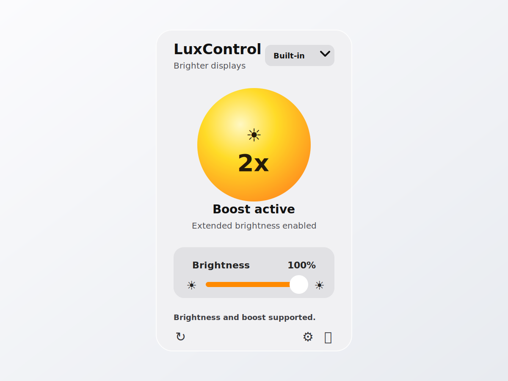

# LuxControl

LuxControl makes supported Mac displays brighter when the usual brightness slider is not enough.

It is made for the moments when the screen looks good indoors, but starts to feel dim near a window, in a bright room, or outside. Open LuxControl from the menu bar, turn on Boost, and keep working without changing how you use your Mac.

## What It Does

- Adds an extra brightness boost on supported XDR and HDR-capable displays.
- Keeps normal brightness control in the same small menu bar window.
- Can start with macOS and optionally turn Boost on automatically.
- Shows clear status when a display supports brightness only, full Boost, or neither.



## How It Works

LuxControl asks macOS which displays are connected, reads the current brightness, and uses the display features already available on compatible hardware. When Boost is turned on, LuxControl gives the display extra headroom and adjusts the brightness curve so bright content becomes brighter while black stays black.

There is no new workflow to learn. Use the menu bar icon, adjust brightness when needed, and turn Boost on or off with one click.

## Best For

- MacBook Pro models with XDR displays.
- Apple Pro Display XDR and other compatible HDR-capable setups.
- Working in sunlight, bright offices, cafes, studios, or anywhere the normal brightness limit feels too low.

## Notes

Display support depends on the Mac, the display, and the current macOS display mode. If LuxControl cannot safely boost a display, it will say so instead of pretending that Boost is available.

## Compatibility

LuxControl requires macOS 14 Sonoma or newer. Release builds are checked on the three latest macOS generations available in GitHub Actions: macOS 26 Tahoe, macOS 15 Sequoia, and macOS 14 Sonoma.

## Install

Download the release zip, move `LuxControl.app` to `/Applications`, and open it from there.

The initial releases are not signed with an Apple Developer ID certificate. If macOS blocks the app after download, remove the quarantine attribute explicitly:

```bash
sudo xattr -cr /Applications/LuxControl.app
```

## Releases

Release builds are produced by GitHub Actions. See [docs/release-policy.md](docs/release-policy.md) for the versioning and release flow.

## Development

Diagnostics are hidden in normal builds. To include the diagnostics section while working locally, build with `-Xswiftc -DDEVELOPMENT_DIAGNOSTICS`.
